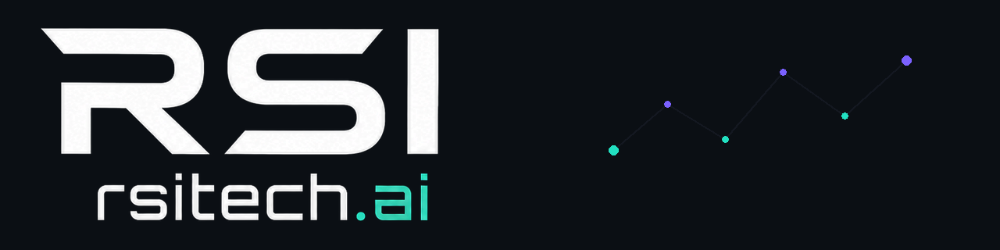

# RSI Tech

RSI Tech is an independent applied-AI engineering studio. Our open-source work focuses on local-first native apps, developer systems, and research tooling.

[rsitech.ai](https://rsitech.ai) · [Repositories](https://github.com/orgs/rsitech-ai/repositories) · [info@rsitech.ai](mailto:info@rsitech.ai)

## Knowledge and capture

- **[LiteratureAtlas](https://github.com/rsitech-ai/LiteratureAtlas)** — local-first research atlas for macOS and iPadOS. `Swift` · [v1.0.0](https://github.com/rsitech-ai/LiteratureAtlas/releases/tag/v1.0.0)
- **[Voice Inbox Watch](https://github.com/rsitech-ai/voice-inbox-watch)** — Apple Watch voice capture with a headless Mac bridge. `Swift` · [v0.1.0](https://github.com/rsitech-ai/voice-inbox-watch/releases/tag/v0.1.0)
- **[IdeaForge](https://github.com/rsitech-ai/IdeaForge)** — native Apple workspace for turning spoken ideas into reviewable engineering packets. `Swift`
- **[Clip Vault](https://github.com/rsitech-ai/clip_vault)** — local-first encrypted clipboard workspace for macOS. `Swift`
- **[SnapAction](https://github.com/rsitech-ai/SnapAction)** — turns screen or image OCR into confirmed Reminders, Calendar events, or clipboard output. `Swift` · [v0.1.0 prerelease](https://github.com/rsitech-ai/SnapAction/releases/tag/v0.1.0)
- **[Meeting Vault](https://github.com/rsitech-ai/meeting-vault)** — local-first meeting recording, transcription, and on-device intelligence for macOS. `Swift`

## Developer and operational tools

- **[Patchwright](https://github.com/rsitech-ai/patchwright)** — local-first control plane for auditable GitHub engineering workflows and approval-gated mutations. `Rust` · [v0.2.0 community prerelease](https://github.com/rsitech-ai/patchwright/releases/tag/v0.2.0-community.2)
- **[Codebase Combiner](https://github.com/rsitech-ai/codebase-combiner)** — combines a workspace into a filtered Markdown or text artifact with token estimates. `Swift` · [macOS v0.1.0](https://github.com/rsitech-ai/codebase-combiner/releases/tag/macos-v0.1.0)
- **[DevScope](https://github.com/rsitech-ai/devscope)** — native macOS activity inspection and local process control. `Swift` · [v0.1.0 preview](https://github.com/rsitech-ai/devscope/releases/tag/v0.1.0-preview.2)
- **[Space Lens](https://github.com/rsitech-ai/space_lens)** — local-first macOS disk intelligence with review-first, recoverable cleanup. `Swift` · [v1.0.0](https://github.com/rsitech-ai/space_lens/releases/tag/v1.0.0)

## Research systems

- **[hlscreen](https://github.com/rsitech-ai/hlscreen)** — read-only Rust TUI for recording, replaying, and screening public Hyperliquid spot market data. `Rust` · [v0.1.2](https://github.com/rsitech-ai/hlscreen/releases/tag/v0.1.2)
- **[Atlas](https://github.com/rsitech-ai/atlas)** — strict-offline, local-first crypto research workstation for macOS. `Python`
- **[AssetRail](https://github.com/rsitech-ai/asset-rail)** — offline macOS prototype for deterministic crypto withdrawal-route planning with synthetic fixtures. It does not connect to exchanges or wallets and cannot submit a withdrawal. `Rust` · [v0.1.0](https://github.com/rsitech-ai/asset-rail/releases/tag/v0.1.0)

## Work with us

[Contributing](https://github.com/rsitech-ai/.github/blob/main/CONTRIBUTING.md) · [Security](https://github.com/rsitech-ai/.github/security/policy) · [rsitech.ai](https://rsitech.ai) · [info@rsitech.ai](mailto:info@rsitech.ai)
